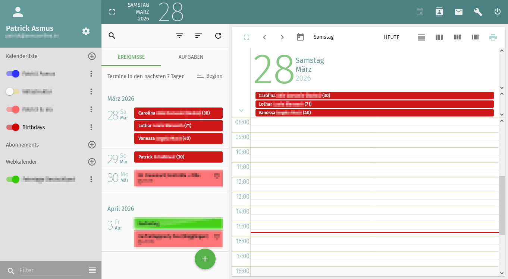

# Mailcow Birthday Daemon 🎂

> **Fork-Hinweis:** Dieses Projekt ist ein Fork von [Marco98/mailcow-birthday-daemon](https://github.com/Marco98/mailcow-birthday-daemon) und wird hier eigenständig weiterentwickelt.

> **Hinweis zur Entwicklung:** Dieses Projekt wird mit Unterstützung von KI-gestützten Entwicklungswerkzeugen gepflegt. Go ist nicht meine primäre Sprache – umso wichtiger sind sauberer Code, Tests und transparente Entwicklung.

Ein einfacher Daemon, der automatisch einen Geburtstagskalender für jede Mailcow-Mailbox erzeugt und synchronisiert. Es ist kein Benutzereingriff erforderlich – alles läuft vollautomatisch.



## Kurzübersicht

- Liest Geburtstage aus allen CardDAV-Adressbüchern jeder Mailbox
- Erstellt und synchronisiert automatisch einen Geburtstagskalender pro Benutzer
- Synchronisation alle **15 Minuten**
- Läuft als Docker-Container direkt im Mailcow-Stack

## Schnellstart

Den folgenden Abschnitt in eine `docker-compose.override.yml` im Mailcow-Verzeichnis (z. B. `/opt/mailcow-dockerized`) einfügen:

> **Wichtig:** Da `mailcow-dockerized` die eigene `docker-compose.yml` bei Updates überschreibt, müssen eigene Anpassungen immer in der `docker-compose.override.yml` erfolgen. Docker Compose lädt diese Datei automatisch und mergt sie mit der Hauptkonfiguration – eigene Änderungen gehen dadurch bei Mailcow-Updates nicht verloren.

```yaml
services:
    birthdaydaemon:
        image: git.techniverse.net/scriptos/mailcow-birthday-daemon:latest
        restart: always
        depends_on:
            - nginx-mailcow
        networks:
            - mailcow-network
        environment:
            - MAILCOW_BASE=https://mail.example.com
            - MAILCOW_APIKEY=DEIN-APIKEY-HIER
        volumes:
            - birthdaydaemon:/data

volumes:
    birthdaydaemon:
```

> **Hinweis:** Das obige Beispiel zeigt nur die minimal nötigen Umgebungsvariablen. Eine vollständige Übersicht aller verfügbaren Umgebungsvariablen findest du im [Schnellstart](docs/schnellstart.md).

Anschließend starten:

```bash
cd /opt/mailcow-dockerized
docker compose up -d
```

> Alle verfügbaren Image-Tags sind in der [Container Registry](https://git.techniverse.net/scriptos/-/packages/container/mailcow-birthday-daemon) einsehbar.

## Repository-Spiegel

| Rolle | URL |
|-------|-----|
| **Master** | https://git.techniverse.net/scriptos/mailcow-birthday-daemon.git |
| **Spiegel** | https://github.com/pscriptos/mailcow-birthday-daemon.git |

> **Hinweis:** Die Entwicklung findet im Master-Repository statt. Der GitHub-Spiegel wird automatisch synchronisiert. Issues und Feature-Requests können sowohl auf [Gitea](https://git.techniverse.net/scriptos/mailcow-birthday-daemon/issues) als auch auf [GitHub](https://github.com/pscriptos/mailcow-birthday-daemon/issues) eingereicht werden.

## Dokumentation

Die vollständige Dokumentation befindet sich im Ordner [`docs/`](docs/README.md).

<p align="center">
  
</p>

<p align="center">
 <a href="./LICENSE">License</a> |  <a href="https://matrix.to/#/#community:techniverse.net">Matrix</a> |  <a href="https://social.techniverse.net/@donnerwolke">Mastodon</a>
</p>
