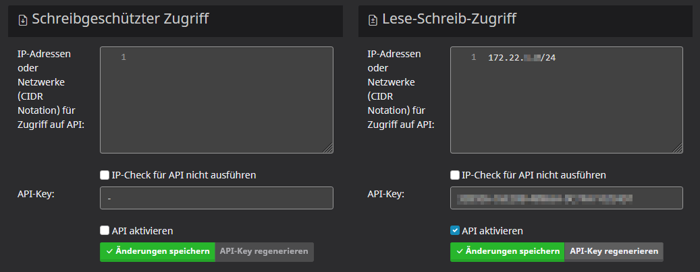

# Schnellstart

## Voraussetzungen

- Eine laufende [Mailcow](https://mailcow.email/)-Instanz mit Docker Compose
- Ein API-Key mit **Lese-/Schreibzugriff** (Admin-Panel → Konfiguration → Zugang → Administratordetails bearbeiten → API)

## Installation

Den folgenden Abschnitt in die `docker-compose.override.yml` der Mailcow-Installation einfügen (z. B. `/opt/mailcow-dockerized/docker-compose.override.yml`):

> **Warum `docker-compose.override.yml`?** Das Projekt `mailcow-dockerized` verwaltet seine eigene `docker-compose.yml` und überschreibt diese bei Updates. Eigene Ergänzungen in der Hauptdatei würden dadurch verloren gehen. Docker Compose erkennt eine `docker-compose.override.yml` im selben Verzeichnis automatisch und mergt deren Inhalte mit der Hauptkonfiguration. Der Birthday Daemon wird so sauber in den Mailcow-Stack integriert, ohne die originale Konfiguration zu verändern.

```yaml
services:
    birthdaydaemon:
        image: git.techniverse.net/scriptos/mailcow-birthday-daemon:latest
        restart: always
        depends_on:
            - nginx-mailcow
        networks:
            - mailcow-network
        environment:
            - MAILCOW_BASE=https://mail.example.com
            - MAILCOW_APIKEY=DEIN-APIKEY-HIER
            - CALENDAR_NAME=Birthdays
            # - MAILCOW_RESOLVE_HOST=nginx-mailcow
            # - NOTIFICATION_ENABLED=true
            # - NOTIFICATION_TIME=08:00
            # - SYNC_INTERVAL=15m
        volumes:
            - birthdaydaemon:/data

volumes:
    birthdaydaemon:
```

> **Wichtig:** `mail.example.com` muss durch den tatsächlichen FQDN der eigenen Mailcow-Instanz ersetzt werden.

> **Hinweis zu `MAILCOW_RESOLVE_HOST`:** Innerhalb eines Docker-Netzes kann der Container die öffentliche Domain (z. B. `mail.example.com`) oft nicht über die externe IP erreichen – ein typisches **Hairpin-NAT-Problem**. Die Variable `MAILCOW_RESOLVE_HOST=nginx-mailcow` sorgt dafür, dass TCP-Verbindungen direkt an den Mailcow-Nginx-Container im selben Docker-Netz aufgebaut werden, anstatt den Umweg über die öffentliche IP zu nehmen. TLS-SNI und die Zertifikatsprüfung verwenden dabei weiterhin den Hostnamen aus `MAILCOW_BASE`, sodass die Verbindung korrekt verschlüsselt bleibt.

> **Tipp:** Statt `:latest` kann auch eine feste Version wie `:0.3.0` verwendet werden. Alle verfügbaren Tags sind in der [Container Registry](https://git.techniverse.net/scriptos/-/packages/container/mailcow-birthday-daemon) einsehbar.

## Container starten

Nach der Konfiguration der Variablen kann der Container initial gestartet werden.

```bash
cd /opt/mailcow-dockerized
docker compose pull birthdaydaemon && docker compose up -d --no-deps birthdaydaemon
```

> **Hinweis:** Nach dem Start wartet der Daemon zunächst **15 Sekunden**, bevor die erste Synchronisation beginnt. Diese Verzögerung stellt sicher, dass abhängige Dienste (z. B. Nginx, SOGo) vollständig bereit sind.

## Umgebungsvariablen

| Variable | Pflicht | Standardwert | Beschreibung |
|---|---|---|---|
| `MAILCOW_BASE` | **Ja** | – | Basis-URL der Mailcow-Instanz (z. B. `https://mailcow.example.com`) |
| `MAILCOW_APIKEY` | **Ja** | – | API-Key mit Lese-/Schreibzugriff aus dem Mailcow-Admin-Panel |
| `MAILCOW_RESOLVE_HOST` | Nein | – | Interner Hostname für TCP-Verbindungen (z. B. `nginx-mailcow`). Löst Hairpin-NAT-Probleme in Docker-Netzen. TLS nutzt weiterhin den Hostnamen aus `MAILCOW_BASE`. |
| `CALENDAR_NAME` | Nein | `Birthdays` | Name des Geburtstagskalenders, der in jeder Mailbox erstellt wird |
| `NOTIFICATION_ENABLED` | Nein | `false` | Aktiviert Kalender-Benachrichtigungen (VALARM) für Geburtstags-Events (`true`/`false`) |
| `NOTIFICATION_TIME` | Nein | `08:00` | Uhrzeit der Benachrichtigung im Format `HH:MM` (nur wirksam wenn `NOTIFICATION_ENABLED=true`) |
| `STATEFILE` | Nein | `state.json` (im Container: `/data/state.json`) | Pfad zur Zustandsdatei, in der App-Passwörter und der aktuelle Kalendername gespeichert werden |
| `SYNC_INTERVAL` | Nein | `15m` | Intervall zwischen den Synchronisationsläufen im Go-Duration-Format (z. B. `10m`, `30m`, `1h`). Mindestwert: `1m`. |

## API-Key erstellen

Den API-Key findet man im Admin-Panel unter Konfiguration → Zugang → Administratordetails bearbeiten → API → Lese-/Schreibzugriff.



> **Warnung:** Da die Mailcow-API derzeit nicht vollständig ist und sich eher im Early-Access-Stadium befindet, wird dringend davon abgeraten, die Option „IP-Prüfung für API überspringen" zu aktivieren. (siehe Bild)

## Prüfen, ob alles läuft

```bash
cd /opt/mailcow-dockerized
docker compose logs -f birthdaydaemon
```

Nach dem Start synchronisiert der Daemon automatisch alle 15 Minuten (konfigurierbar über `SYNC_INTERVAL`) die Geburtstagskalender für jede Mailbox.

> **Hinweis für bestehende Installationen:** Falls der Daemon die Mailcow-API wegen Hairpin-NAT nicht erreichen kann, muss lediglich `MAILCOW_RESOLVE_HOST=nginx-mailcow` als Umgebungsvariable ergänzt werden. Details siehe [Installationsabschnitt](#installation).

> **Bei Problemen:** Siehe [Troubleshooting](troubleshooting.md).

> **Wie funktioniert der Daemon im Detail?** Siehe [Funktionsweise](funktionsweise.md).
